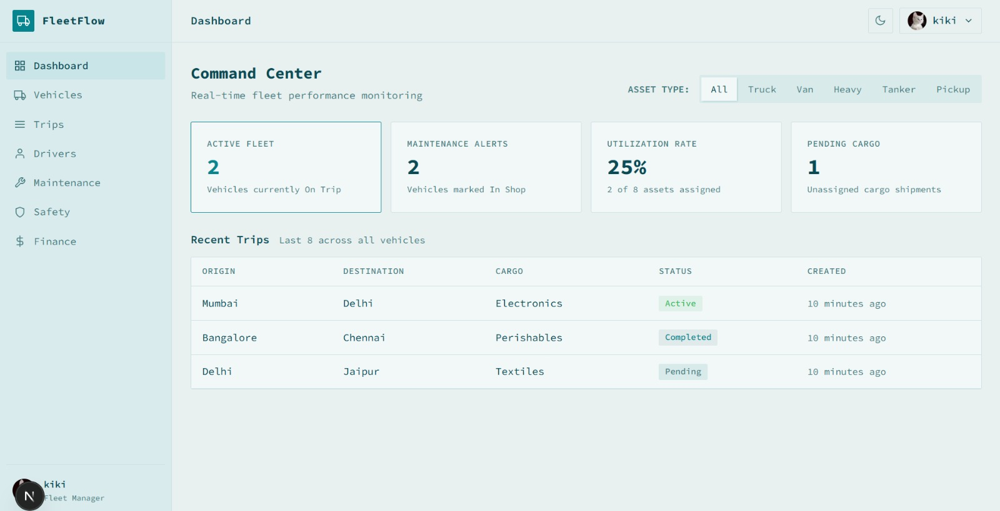
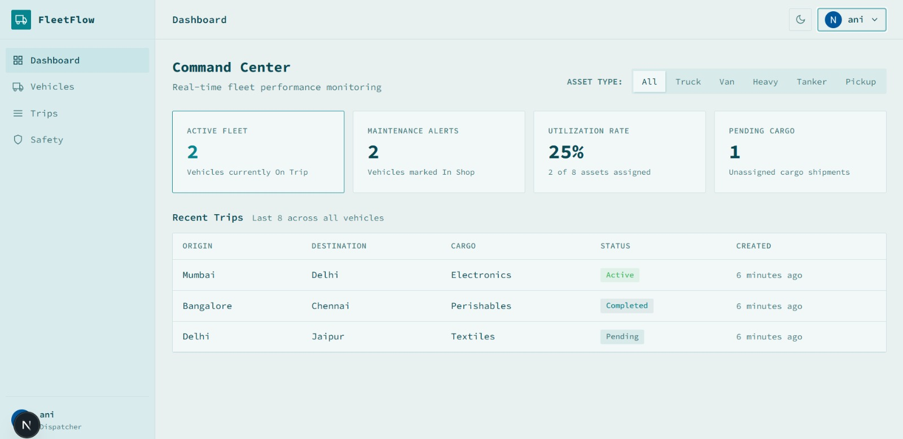
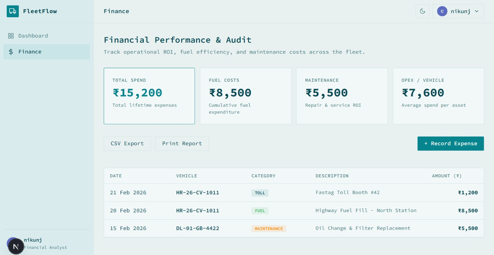

<div align="center">
  <h1>FleetFlow - Intelligent Fleet Management System</h1>

  **Team Name**: Team Rocket  
  **Hackathon**: Odoo x Gujarat Vidyapith Hackathon '26
</div>

<hr />

FleetFlow is a comprehensive fleet management and logistics coordination platform designed to optimize supply chain operations. It provides real-time tracking, asset management, and role-based operational workflows to ensure efficiency, safety, and financial transparency.

## Core Modules

**1. Command Center (Dashboard)**  
A centralized hub providing real-time fleet KPIs. Includes dynamic filtering by asset type (Truck, Van, Heavy, etc.) and visualization of utilization rates, maintenance alerts, and pending cargo status.

**2. Vehicle & Driver Registry**  
Complete lifecycle management for physical assets and personnel. Tracks vehicle technical specifications, odometer readings, and maintenance schedules. Manages driver documents, safety scores, and license compliance.

**3. Smart Trip Dispatcher**  
Operational core for scheduling and tracking deliveries.
- Automatic weight validation against vehicle capacity.
- Integrated asset availability checks (only idle vehicles and active drivers).
- Real-time status synchronization between trips and assets.

**4. Safety & Compliance**  
Monitoring dashboard for preventative maintenance and regulatory compliance.
- License expiry alerts for drivers.
- Maintenance overdue tracking for vehicles.
- Driver safety watchlist based on behavioral scores.

**5. Finance & Audit**  
Transaction ledger for operational expenditure.
- Fuel, toll, and maintenance cost tracking.
- Aggregate spend analytics per vehicle.
- CSV and Print-ready reporting for financial audits.

---

## Role-Based Access Control (RBAC)

The system enforces strict data isolation and functional gating based on the authenticated user's role.

**Fleet Manager**  
Full administrative control over all modules, including user approvals and system-wide asset modifications.  


**Dispatcher**  
Operational access focused on trip coordination, vehicle status management, and basic safety monitoring.  


**Safety Officer**  
Focused on compliance, driver documentation, vehicle maintenance logs, and safety watchlists.  


**Financial Analyst**  
Restricted access to the dashboard and finance module for cost auditing and ROI reporting.  


---

## Technical Stack

- **Frontend**: Next.js (App Router), React, TypeScript
- **Backend & Database**: Supabase (PostgreSQL)
- **Authentication**: Supabase Auth (with RBAC Triggers)
- **Styling**: Vanilla CSS with Design Tokens
- **State Management**: React Hooks & Server Components

---

## Setup Guide

**Prerequisites**  
- Node.js 18.x or later
- npm or pnpm
- A Supabase Project

**Installation**  

1. Clone the repository:
   ```bash
   git clone https://github.com/Annieeeee11/fleetflow.git
   cd fleetflow
   ```

2. Install dependencies:
   ```bash
   npm install
   ```

3. Configure Environment Variables:
   Create a `.env` file based on `.env.example` and add your Supabase credentials.

4. Run the development server:
   ```bash
   npm run dev
   ```

The application will be available at `http://localhost:3000`.

---

## Environment Configuration

The following keys are required in your `.env` file for the application to function correctly:

- `NEXT_PUBLIC_SUPABASE_URL`: Your Supabase project URL.
- `NEXT_PUBLIC_SUPABASE_ANON_KEY`: Your Supabase anonymous API key.
- `SUPABASE_SERVICE_ROLE_KEY`: Required for administrative operations in server components.
